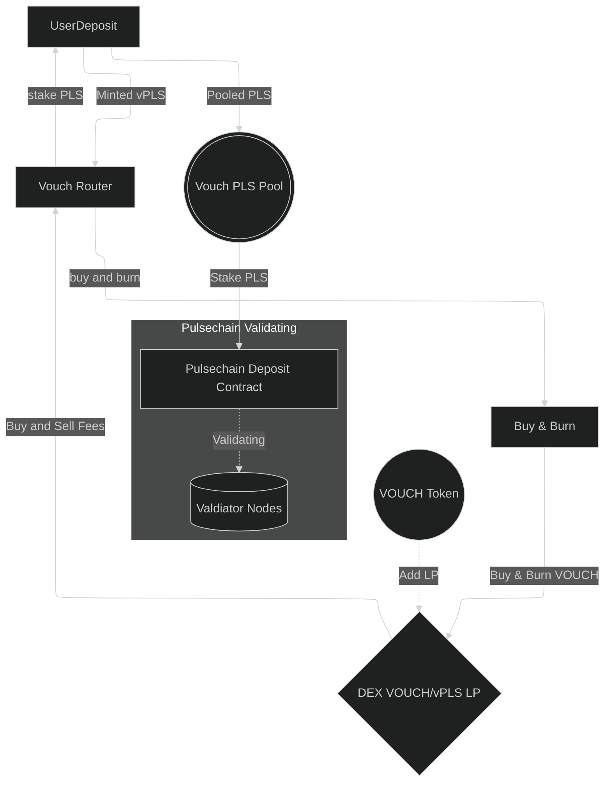

<!-- 
Diagram Generator:
https://www.mermaidchart.com/play#pako:eNplkVFrwjAUhf_KJQ9DH-LefRDWdWMPbgvaloEVjE3UYEhGmzpE_O_LbWKL-NRyz3d7zzm9kMoKSaaEUlrWpams2an9FF8BND_b1k1B6iMOIrLT9q868NpBlgSuyEajkmyK7_z1AzJ7lGZTkvEYgpq-_Vy86h_QEc8nNl_CnHnmGpFiscJ921YHWPiTsvbiOmh5ilreyDqVv7ZRbpASk6CWtGd4gqStzSCxbou1upHeqzLwsMys1aPgu7uLpnDWWR9HX1w3qw7hWijubA1fvq4GmfXNewZ0Ai9C-EgwoTPM2wcHSqEkaJAbAUupNbxL2ZTECzMfu88fwMbxo0QnEcjTWwdB_1TGSQGngSgW9wQm8MQA4CBIy_uPs_T-9jaa3Poe467vty96SBKqDv8ygn1klmIZvi0luFNm3xWCLaJMrv9ocbxd -->

<!-- ---
config:
 layout: elk
 look: classic 
 theme: dark
--- -->
